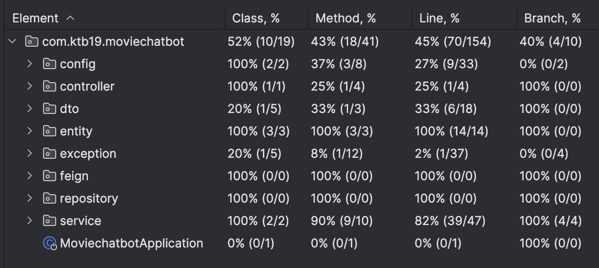
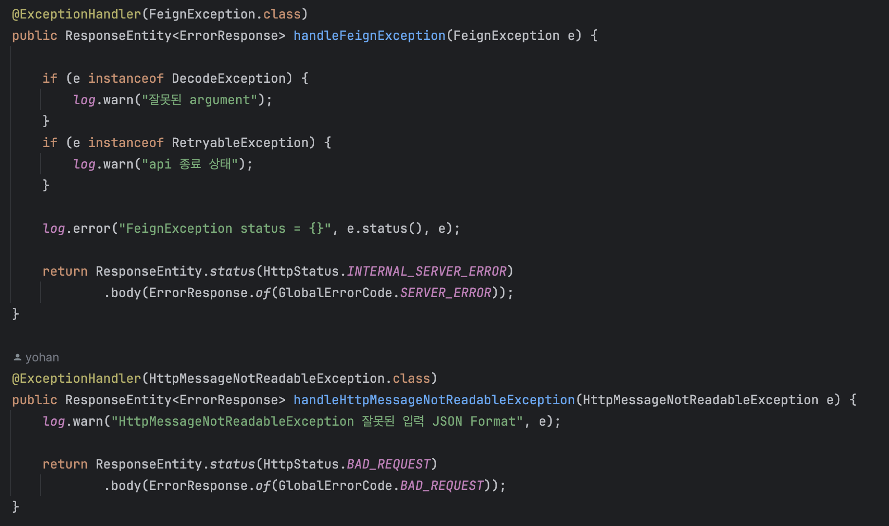
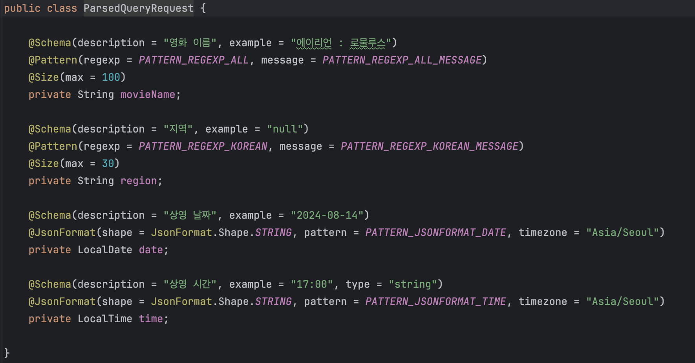

# 백엔드
> 김요한 담당

- RESTful API 설계에 대한 이해 및 적용
- BDDMockito, JUnit5를 사용한 단위 테스트 작성

- ExceptionHandler을 통한 공통 예외 처리
  - 전역에서 발생하는 예외를 한 곳에서 처리함으로써, 예외 처리 로직을 모듈화하고 유지보수성 높임
  - 로깅을 통해, 모니터링과 디버깅이 수월

- Validation 과정을 통해 데이터 유효성 검증
    - Pattern, Size 지정을 통해 요청 형식 제한
    - 데이터 무결성 보장 및 보안 강화

- Swagger를 사용한 API 명세서 작성
- AI 워드 임베딩 과정 스케줄링