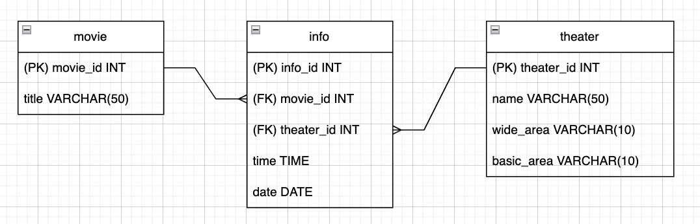

# 크롤링
> 이미르 담당

- **Kobis에서 제공하는 지역별 및 날짜별 상영 스케줄 정보를 크롤링**
    - 7일치의 정보를 크롤링 + 새롭게 올라온 날짜의 상영 스케줄 크롤링
    - 선택된 조건에 맞는 영화 상영 스케줄 정보 수집
        - 광역 선택 -> 기초 선택 -> 영화관 선택 -> 날짜 선택 순서로 크롤링 절차를 진행하여 사용자가 3~4회의 버튼 클릭으로 영화 상영 스케줄 정보를 수집하도록 구현
- **DB 설계 및 데이터 저장**
    - 크롤링한 상영 스케줄 데이터를 효율적으로 조회할 수 있도록 DB 테이블 설계
    - 상영 정보 조회 속도와 데이터 정합성을 고려하여 영화관, 영화 테이블의 정보를 기준으로 상영정보를 조회하도록 함
  
- **크롤링 속도 개선을 위해 멀티프로세싱 적용**
  - 여러 영화관의 상영 정보를 동시에 수집하여 시간 최적화
  - 시간 최적화
