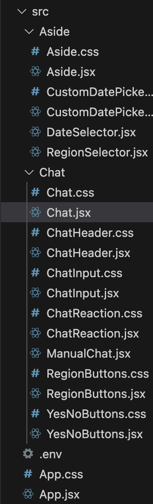
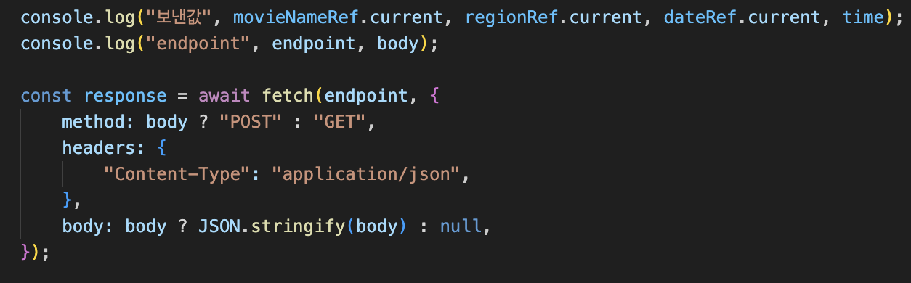
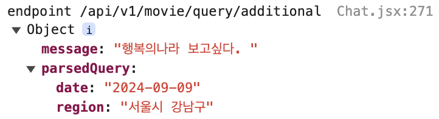
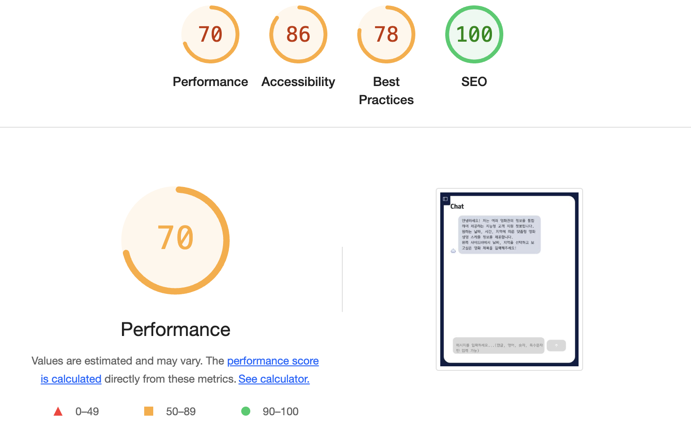
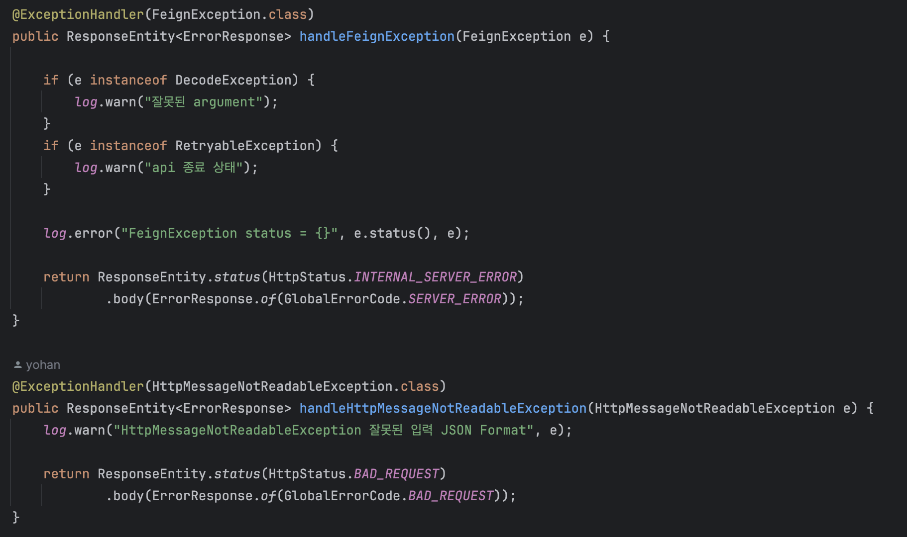

- 크롤링
    - **Kobis에서 제공하는 지역별 및 날짜별 상영 스케줄 정보를 크롤링**
        - 7일치의 정보를 크롤링 + 새롭게 올라온 날짜의 상영 스케줄 크롤링
        - 선택된 조건에 맞는 영화 상영 스케줄 정보 수집
            - 광역 선택 -> 기초 선택 -> 영화관 선택 -> 날짜 선택 순서로 크롤링 절차를 진행하여 사용자가 3~4회의 버튼 클릭으로 영화 상영 스케줄 정보를 수집하도록 구현
    - **DB 설계 및 데이터 저장**
        - 크롤링한 상영 스케줄 데이터를 효율적으로 조회할 수 있도록 DB 테이블 설계
        - 상영 정보 조회 속도와 데이터 정합성을 고려하여 영화관, 영화 테이블의 정보를 기준으로 상영정보를 조회하도록 함
      
    - **크롤링 속도 개선을 위해 멀티프로세싱 적용**
      - 여러 영화관의 상영 정보를 동시에 수집하여 시간 최적화
      - 시간 최적화
- 프론트엔드
    - React를 사용한 사용자 인터페이스 구축
        - React 라이브러리를 사용한 컴포넌트 기반 UI 설계 및 구축
        - UI 모듈화를 통해 각 컴포넌트의 독립적 개발 및 유지보수 가능성 향상과 코드 재사용성 극대화
      
      
  - **상태 관리 및 전역 상태 관리**
    - useState를 활용한 동적 데이터(사용자 입력 값, 서버로부터 받은 데이터 등) 관리
    - useEffect를 통한 컴포넌트 생명주기 기반 데이터 페칭 및 DOM 업데이트 처리
    - useRef를 사용하여 최신 상태 유지와 즉시 참조 가능성 확보
    - 상태 변경에 따른 자동 렌더링 및 코드 간결화로 유지보수성 향상
    - Context API를 통한 전역 상태 관리 도입
        - 중복된 상태 전달 없이 필요한 데이터에 직접 접근할 수 있도록 개선하여 코드 가독성 향상
  
  - **백엔드 API와의 통신**
      - 사용자 입력 기반 영화 정보(영화 이름, 지역, 날짜 등)를 처리하는 비동기 통신 구현
      - fetch API를 사용하여 백엔드 서버와 통신하며, 실시간 상영 스케줄 정보 및 응답값 반환
          - 네트워크 지연 없는 사용자 경험 최적화
  
  
  - 핵심 기능
    - 실시간 영화 상영 정보 제공: 사용자의 질문에 대한 응답 제공 및 사용자가 입력한 영화, 지역, 날짜 정보를 바탕으로 상영 시간 정보를 실시간으로 제공
    - 상태 기반 UI 업데이트: 사용자 입력 및 백엔드 응답에 따른 UI 실시간 변경 처리. 지역 선택 시 입력값과 응답값에 따른 동적 업데이트.
    - 유연한 필터링 및 데이터 처리: 영화, 지역, 날짜 등의 선택에 따른 유동적인 데이터 필터링 및 항목 변경 시 즉각 처리.
  
  - lighthouse 지표

- 백엔드
  - RESTful API 설계에 대한 이해 및 적용 (설계 및 API 명세서 작성)
  - Swagger를 사용한 API 명세서 작성 (설계 및 API 명세서 작성)
  - BDDMockito, JUnit5를 사용한 단위 테스트 작성 (테스트 작성)
  
  - ExceptionHandler을 통한 공통 예외 처리 (예외 처리)
    - 전역에서 발생하는 예외를 한 곳에서 처리함으로써, 예외 처리 로직을 모듈화하고 유지보수성 높임
    - 로깅을 통해, 모니터링과 디버깅이 수월
  
  - Validation 과정을 통해 데이터 유효성 검증 (검증 과정 추가)
      - Pattern, Size 지정을 통해 요청 형식 제한
      - 데이터 무결성 보장 및 보안 강화
  
  - AI Vectorize 과정 스케줄링