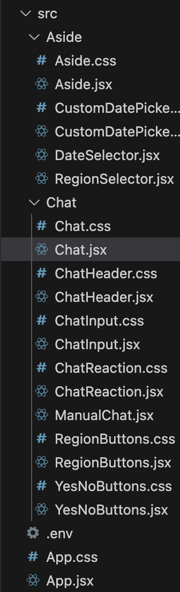
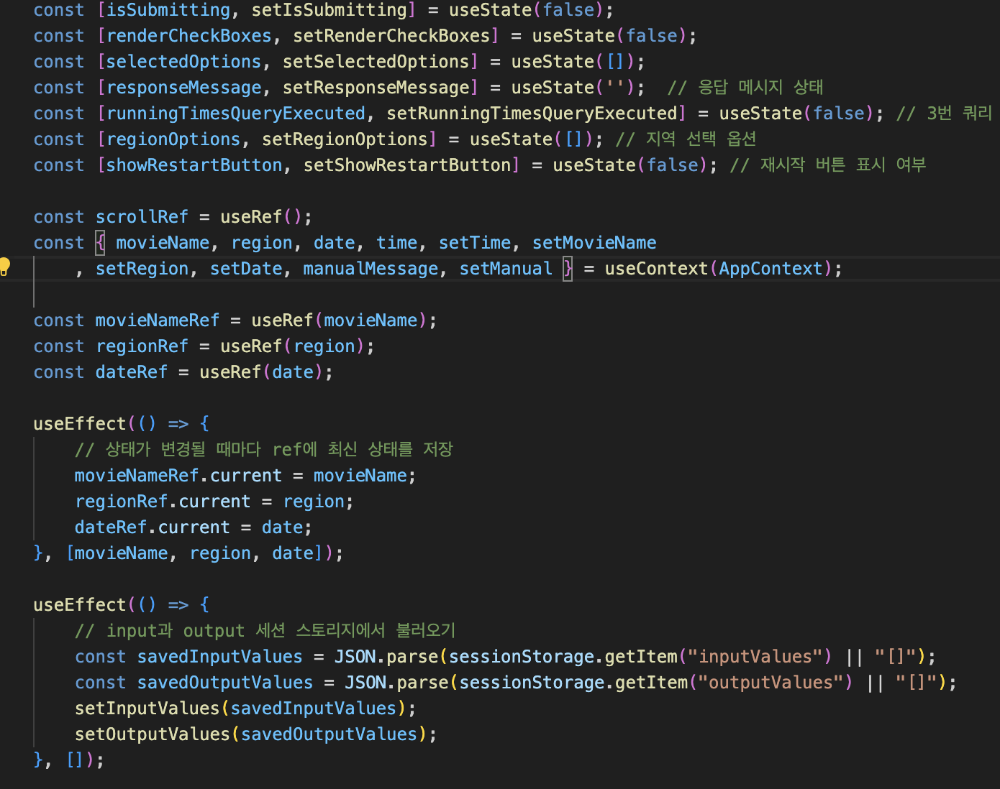
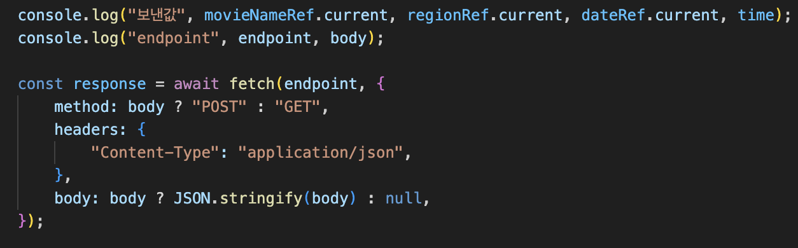
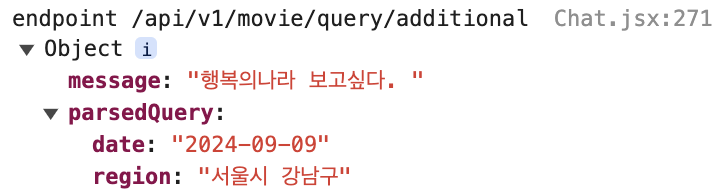
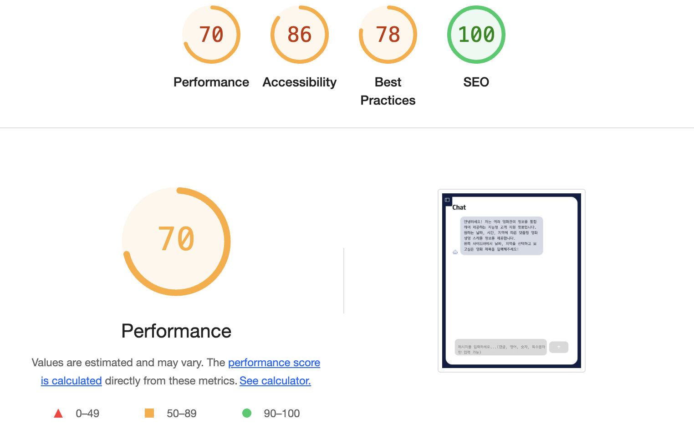

# 프론트엔드
> 이미르 담당

- React를 사용한 사용자 인터페이스 구축
    - React 라이브러리를 사용한 컴포넌트 기반 UI 설계 및 구축
    - UI 모듈화를 통해 각 컴포넌트의 독립적 개발 및 유지보수 가능성 향상과 코드 재사용성 극대화

    

- **상태 관리 및 전역 상태 관리**
  - useState를 활용한 동적 데이터(사용자 입력 값, 서버로부터 받은 데이터 등) 관리
  - useEffect를 통한 컴포넌트 생명주기 기반 데이터 페칭 및 DOM 업데이트 처리
  - useRef를 사용하여 최신 상태 유지와 즉시 참조 가능성 확보
  - 상태 변경에 따른 자동 렌더링 및 코드 간결화로 유지보수성 향상
  - Context API를 통한 전역 상태 관리 도입
      - 중복된 상태 전달 없이 필요한 데이터에 직접 접근할 수 있도록 개선하여 코드 가독성 향상
    

  - **백엔드 API와의 통신**
      - 사용자 입력 기반 영화 정보(영화 이름, 지역, 날짜 등)를 처리하는 비동기 통신 구현
      - fetch API를 사용하여 백엔드 서버와 통신하며, 실시간 상영 스케줄 정보 및 응답값 반환
      - 네트워크 지연 없는 사용자 경험 최적화

  - 핵심 기능
    - 실시간 영화 상영 정보 제공: 사용자의 질문에 대한 응답 제공 및 사용자가 입력한 영화, 지역, 날짜 정보를 바탕으로 상영 시간 정보를 실시간으로 제공
    - 상태 기반 UI 업데이트: 사용자 입력 및 백엔드 응답에 따른 UI 실시간 변경 처리. 지역 선택 시 입력값과 응답값에 따른 동적 업데이트.
    - 유연한 필터링 및 데이터 처리: 영화, 지역, 날짜 등의 선택에 따른 유동적인 데이터 필터링 및 항목 변경 시 즉각 처리.
  
  - lighthouse 지표

