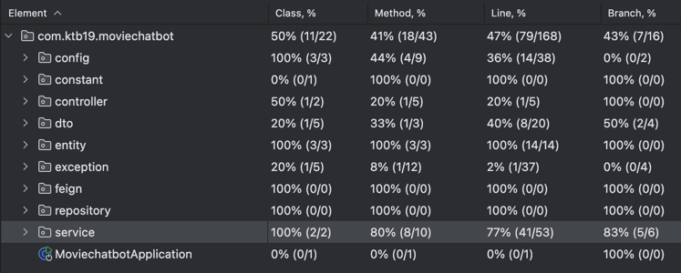

# 테스트 작성 문서화

## 개요
- Service, Repository 검증을 위해 BDDMockito를 사용해 단위 테스트, 통합 테스트 작성
- Service Coverage : Method 8/10, Branch 5/6

## 테스트 목적
- Service, Repository 클래스에서 제공하는 주요 기능들이 올바르게 동작하는지 검증
- 예외 상황 테스트

## 테스트 종류
- 단위 테스트 (Unit Test)
- 통합 테스트 (Integration Test) : 데이터베이스 연동을 포함한 테스트

## 테스트 범위
- Service 클래스 기능 테스트
- Repository 클래스 쿼리 동작 테스트

## 테스트 도구
- JUnit5
- Mockito : Mock 객체를 사용해 단위 테스트를 작성하기 위해 사용
- BDDMockito : 테스트 가독성을 위해 BDD(Behavior-Driven Development) 스타일의 테스트를 작성
- DataJpaTest : Spring Data JPA 관련 기능을 집중적으로 테스트하기 위해 사용
  - JPA 관련된 컴포넌트만을 로드하여 Repository 계층 테스트에 집중
  - 트랜잭션을 관리하여 일관성 유지
- DB : 신속한 반복 테스트를 위해 빠른 초기화 및 쿼리 성능을 제공하는 H2 in-memory DB 사용

## 테스트 작성 방법론
- TDD : 최대한 시도했으나, 100% 따르진 못함. 미리 생각치 못한 문제가 발생하는 경우가 많아, 테스트 설계가 어려웠음.
- Given-When-Then 패턴: 행동 기반으로 Given(준비 상황), When(행동), Then(결과 검증)을 명확히 구분해 테스트를 작성함
- @DisplayName : 테스트 목적을 명확히 명시함

## 커버리지

- Service Coverage : Method 8/10, Branch 5/6
- Repository는 Interface라 커버리지에 포함이 안된다.

## 개선할 점
- 커버리지와 별개로 테스트 하지 못한 부분들이 남았기 때문에, 테스트 추가를 해야한다.
- 코드 중복이 많아, 리팩토링을 통해 개선할 수 있을 것 같다. 