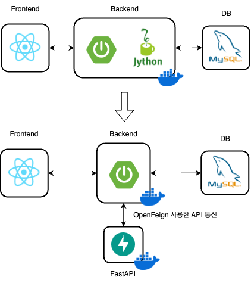

# 백엔드
> 김요한 담당

## 아키텍처 구조 변경을 통해 Jython 한계 문제 해결

### 문제1

- 인공지능 팀에서 Python 코드를 작성하기 때문에, 이를 구동시키기 위한 방법이 고민되는 상황
- 선택지
    - Spring 애플리케이션에서 Jython을 사용해 구동
    - Python 코드를 구동시키기 위한 서버를 따로 분리

### 해결

- Spring 애플리케이션에서 **Jython**을 사용해 구동하기로 결정
- 서버를 분리할 시, 서버 간 통신과정 추가로 인해 지연 시간 증가 및 유지보수 비용 증가가 예상되었기 때문

### 문제2

- AI 팀과의 협업때문에, Spring에서 Python 사용을 위해 Jython 사용하는 상황
- Jython이 로컬에선 동작하는데, Docker 환경에선 패키지 import 문제 발생

### 해결

- Docker 이미지 내에서 **Python 패키지 관리 어려움**이 원인
- 추가로 **Jython이 Python 2.7까지만 지원 & AI 작업 리소스가 클 것으로 예상됨**
- 그래서 **서버를 분리**해  **FastAPI**에서 구동하기로 결정
- 비동기 처리가 필요없어 WebClient 대신   
  인터페이스, 어노테이션 기반의 편리한 **OpenFeign**으로 API 통신



- 효과
    - 책임 분산 및 확장성 개선
        - AI 코드 실행에 대한 책임을 FastAPI가 맡음으로써, Spring 애플리케이션은 비즈니스 로직에 집중 가능하고, 이로 인해 확장성 및 유지보수성이 상승함
    - 장애 격리로 안정성 강화
        - AI 코드 실행이 리소스를 많이 소모하기 때문에, 이로 인한 장애 발생 시 Spring 애플리케이션에 문제 전염되는 것을 차단
    - 성능 및 처리 효율성 증가
        - FastAPI는 비동기 처리를 잘 지원해서, AI 작업을 보다 빠르고 효율적으로 처리 가능

---

## 여러 객체에 흩어져있는 정보를 어떻게 한 번에 묶을 수 있을까?

### 문제

- 영화 상영 정보, 영화관 객체를 사용해 영화관 별 상영정보를 얻어야 하는 상황

### 해결

- stream의 groupingBy, mapping을 사용해 해결

```java
Map<String, List<Time>> timesPerTheaterNameMap = dto.stream()
                .collect(
	                groupingBy(
		                d -> d.getTheater().getName(), 
		                mapping(d -> d.getMovieInfo().getTime(), toList())
	                )
                );