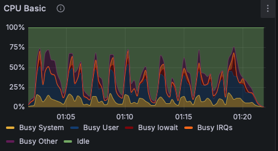
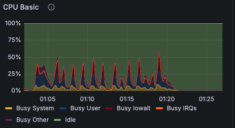
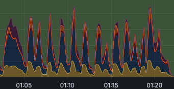
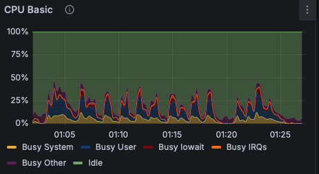

# 클라우드
> 김도경, 김민우 담당

## 목차
1. [Mysql 도커 이미지로 EC2에서 Endtrypoint 에러](#1-mysql-도커-이미지로-ec2에서-endtrypoint-에러)
2. [Python Crawling 이미지 생성 중 chrome browser 설치 문제](#2-python-crawling-이미지-생성-중-chrome-browser-설치-문제)
3. [크롤링 인스턴스의 적절한 type 설정](#3-크롤링-인스턴스의-적절한-type-설정)
4. [크롤링 이외의 시간에 사용되지 않는 인스턴스](#4-크롤링-이외의-시간에-사용되지-않는-인스턴스)
5. [인스턴스와 서브넷 등의 네트워크 관계에 대한 공부의 필요성](#5-인스턴스와-서브넷-등의-네트워크-관계에-대한-공부의-필요성)
6. [CI/CD는 모든 상황에서 필요한 것인가?](#6-cicd는-모든-상황에서-필요한-것인가)
7. [Docker container 배포시 각 컨테이너의 연결 방법에 대한 고민](#7-docker-container-배포시-각-컨테이너의-연결-방법에-대한-고민)

---

# 1. Mysql 도커 이미지로 EC2에서 Endtrypoint 에러

### 문제

- 도커 이미지로 만든 Mysql 이미지를 EC2 인스턴스에서 실행시 아래 에러가 났다.
- DB 이미지에 초기 테이블과 스키마를 설정해주기 위해 넣은 init.sql 파일의 권한 에러가 났다.

```java
[Note] [Entrypoint]: /usr/local/bin/docker-entrypoint.sh: running /docker-entrypoint-initdb.d/init.sql
/usr/local/bin/docker-entrypoint.sh: line 75: /docker-entrypoint-initdb.d/init.sql: Permission denied
```

### 시도

1. 처음 에러를 보고 든 생각은 /usr/local/bin의 디렉토리만 보고 도커와 Mount된 Host 디렉토리에 대한 권한이 없는 줄 알고 해당 컨테이너와 Mount된 볼륨 권한을 설정해줬지만 에러가 났다.
2. 다시 에러 메시지를 살펴보니 이미지 생성 할때 넣어준 init.sql 파일이였다.
    - init.sql을 로컬에서 생성해서 파일 읽기 권한이 root에만 있어서 도커가 실행되고 나서 접근할 수 없었다.

### 해결

```docker
chmod 755 명령어를 dockerfile에 추가해 주었더니 성공 했다.
```

# 2. Python Crawling 이미지 생성 중 chrome browser 설치 문제

### 문제

- 풀스텍 팀원이 작성한 Python 코드를 인스턴스에 도커 이미지로 생성하려고 했다.
    - 이전에 미리 코드 작성하면서 사용한 의존성들을 작성해달라고 했다.
    - 아래와 같은 의존성들이 필요했다.

    ```docker
    selenium
    python-dotenv
    coverage
    pymysql
    schedule
    apscheduler
    cryptography
    ```

- 해당 의존성을 다 포함해서 이미지를 만들었지만, 코드가 작동이 되지 않았다.
- Selenium은 chrome broswer를 사용하는데, 당연히 로컬 환경에서는 깔려있어서 고려를 하지 못했다.

### 시도한 것

- 우선 인스턴스에서 실행되는 도커에 bash로 접속하여, linux용으로 만들어진 chrome을 공식 홈페이지에서 wget으로 다운받아 코드를 실행 했더니 잘되어서 Dockerfile에 포함 시켜서 이미지를 빌드했다.
    - RUN 명령어를 사용하여 설치하려고 했는데 수많은 에러가 났다.
- CMD 명령어로 시도를 해봤지만, python 실행 명령어를 사용할 수 없었다.
- shell 스크립트를 이미지에 포함해서 이미지를 만들어 실행했지만, 해결 할 수 없는 에러가 났다.

### 해결

**결국 python이외의 아무것도 추가하지 않은 이미지를 실행시키고 bash에 붙어서 필요한 환경을 구축하고 사용한 명령어 그대로 Dockerfile에 작성했다.**

- 그랬더니 성공했다!

```docker
FROM python:3.12

# 작업 디렉토리 설정
WORKDIR /app

# 루트 디렉토리의 모든 파일을 컨테이너의 /app 디렉토리로 복사
COPY . /app

RUN apt-get update
RUN pip install -r requirements.txt
RUN wget https://dl.google.com/linux/direct/google-chrome-stable_current_amd64.deb
RUN apt-get install -y ./google-chrome-stable_current_amd64.deb

ENTRYPOINT [ "python", "main.py" ]
```

# 3. 크롤링 인스턴스의 적절한 type 설정

### 문제

- 크롤링이 멀티프로세싱을 이용함.
- 로컬에서 apple m2 pro 프로세서로 테스트시 하루치 데이터를 가져오는데 약 20분이 걸림
    - 로컬보다 cpu 개수가 낮은 인스턴스는 적합하지 않다고 판단.
    - 별다른 테스트 없이 4 cpu 8gb 인스턴스인 c6i.xlarge를 사용
- 하지만 가격이 너무 비싸 인스턴스 조정을 하고 싶었음

### 시도 한 것

- 모니터링을 공부하고 구축한 상황이라 여러 인스턴스를 만들고 동시에 실행 시켜 모니터링을 시도했음
- Promethues를 활용하여 1일치 데이터를 크롤링에 걸리는 시간과 리소스를 비교

### 결과

**c6i.large (2core, 4gb, 0.096$)**



**t2.large (2core, 8gb, 0.11$)**



**t2.xlarge (4core , 8gb, 0.23$)**



**c6i.xlarge (4core, 8gb, 0.19$)**



**CPU Core 개수와 램의 스펙에 상관없이 일정하게 약 25분이 걸렸다. 예상과는 다른 결과에 놀랐지만, 가격이 제일 저렴하고, 효율적으로 리소스를 사용하는 `c6i.large` 인스턴스를 사용하기로 결정**

# 4. 크롤링 이외의 시간에 사용되지 않는 인스턴스

### 문제

- c6i.large는 기본적인 인스턴스(t2.micro, t2.small)들에 비해 가격이 높은 편
- 하지만 사용되는 시간보다 사용되지 않는 시간이 더 많음
- 필요할 때만 리소스를 사용할 수 있는 방법을 찾아야함

### 시도한 것

- AWS lambda + EventBridge 를 이용한 방법
    - 하지만 labmda 함수는 최대 15분까지만 작동되는 한계점이 있어, 크롤링이 이 시간보다 더 많이 작동 되어 사용하지 못함.
- AWS Fargate와 EventBridge를 사용하는 방법
    - Container Image로 만든 크롤링 앱을 ECS 클러스터를 통해 Task로 정의하면, 정해진 시간에만 인스턴스를 활용하여 실행시킬 수 있음

### 결과

- 관련 지식 기반이 부족 및 시간 부족으로 인해 아직 구현하지 못했음.

# **5. 인스턴스와 서브넷 등의 네트워크 관계에 대한 공부의 필요성**

- 각 파트의 도커 이미지를 만들어 배포를 하기 전 까지는 수월하고 도커 컴포즈를 통한 로컬 테스트까지 순조롭게 진행하였음.
- 하지만 아키텍쳐에 맞게 배포를 하는 과정에서 프라이빗 서브넷, 퍼블릭 서브넷 등의 인스턴스와 서브넷 등의 정확한 의미를 깨닫지 못하고 배포를 하는 과정에서 IP주소 밑 같은 대역의 연결이 맞는건지 헷갈리기도 했었음
- 결국 네트워크에 관한 서칭으로 각 서브넷에 대한 관계를 깨닫고 다시 배포를 실시하였고 성공하였음.

# **6. CI/CD는 모든 상황에서 필요한 것인가?**

- 항상 코드를 푸시할때마다 배포를 하게 된다면 과연 좋을까?
- 변경이 자주되는 코드(이미지)가 있는 반면에, 한 번 올려두면 절대 변하지 않을 코드(이미지)들도 존재한다. 따라서 항상 모든 이미지를 새로 배포하는 것이 아닌 프로젝트 특성을 고려해서 변경이 자주 되는 부분과 한 번 올려두면 끝인 부분을 구분해둬서 workflows를 구성하려고 하였다.

# 7. Docker container 배포시 각 컨테이너의 연결 방법에 대한 고민

- 이번 프로젝트는 인스턴스를 2개로 나누어 각 컨테이너가 사용하는 리소스 량에 따라 인스턴스 스펙을 나누어 배포를 실시하였습니다.
- 이때 한 인스턴스에 backend, ai의 연결 관계에서는 docker의 network를 이용하여 연결을 진행하였습니다.
- Docker network를 사용하지 않으면은 매 배포마다 다른 IP를 부여받아서 연결이 항상 잘 되지 않았던 문제가 있었는데 같은 인스턴스 내에서 배포를 하여 연결하는 과정에서는 docker network를 사용하여 연결하는 방법을 이용하였습니다.
- 그렇다면 다른 인스턴스에서 연결 할 때, 서브넷이 다를때의 연결 방식 또한 다르다는 걸 알았고 그런 상황들에 대비하여 pipeline를 짤때 고려해야할 점이 더 있다는 것 또한 알게 되었습니다.
- 컨테이너들 간의 연결 시 인스턴스의 사용, 서브넷 등의 의해 연결 방식 또한 방법이 나뉘는 것을 알게 되었습니다.

1. HTTPS, HTTP 도메인 관련 허용
- 일반적으로 안전한 사이트를 위해 HTTPS를 사용합니다.
- HTTPS는 SSL/TLS 프로토콜을 사용하여 데이터를 암호화를 하게 됩니다.
- SSL 인증서를 구입하고, 웹 서버에 설치하는 과정이 필요합니다. SSL 인증서는 공인된 인증 기관(CA)으로부터 구입할 수 있으며, 인증서의 종류에 따라 가격과 보안 수준이 다릅니다.